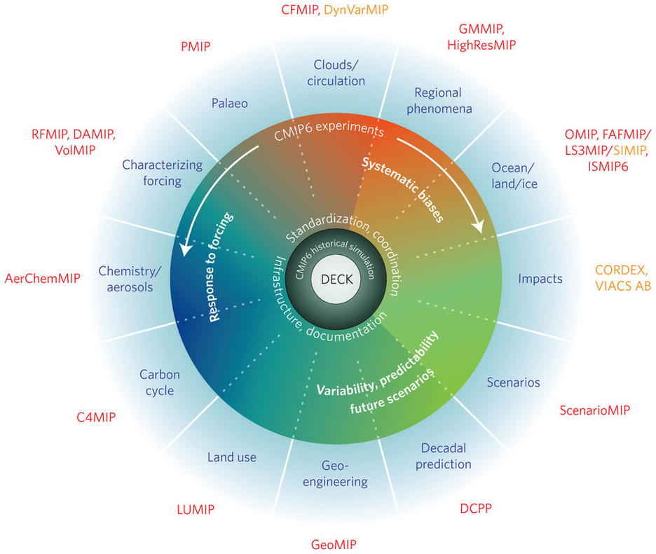
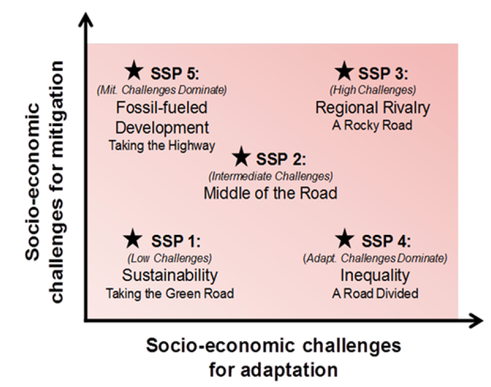
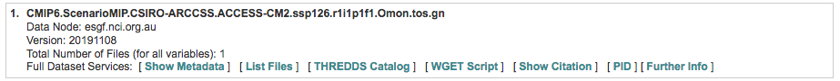
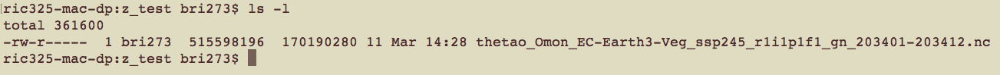
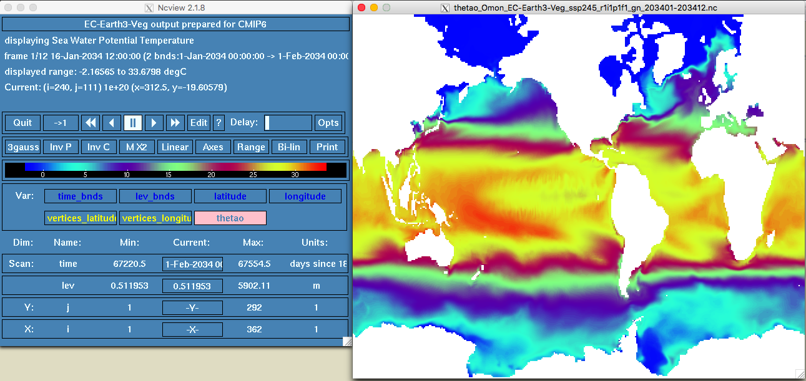
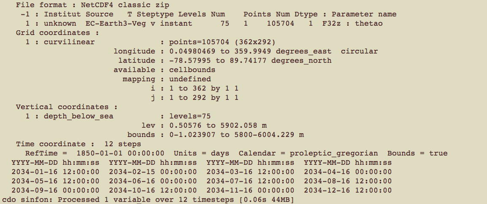
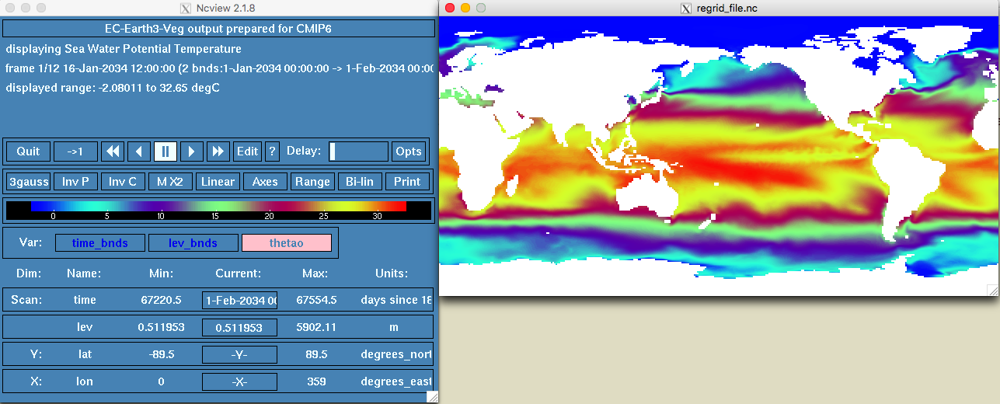

- [1. CMIP6 models? What the F*** is that?]
- [2. Variable Choice]
- [3. Working with CMIP6 netCDF files using CDO (Climate data operators)]
- [4. CDO with multiple input models/files]
- [5. CDO extra functions]
- [6. Running CDO in the cluster (awoonga/flashlite)]

# 1. CMIP6 models? What the F*** is that?

**CMIP6** stands for Coupled Model Intercomparison Project (CMIP). These are climate models that simulate the physics, chemistry and biology of the atmosphere in detail (some of them!). The 2013 IPCC fifth assessment report (AR5) featured climate models from CMIP5, while the upcoming 2021 IPCC sixth assessment report (AR6) will feature new state-of-the-art CMIP6 models ([more info in Carbon Brief website. ](https://www.carbonbrief.org/cmip6-the-next-generation-of-climate-models-explained))

The main goal is to set future climate scenarios based on *future* concentrations of **greenhouse gases**, **aerosols** and other [**climate forcings**](https://www.carbonbrief.org/qa-how-do-climate-models-work#inout) to project what might happen in the future. 

```{r general, echo = FALSE, fig.cap = "Schematic of the CMIP/CMIP6 experimental design", out.width = '70%'}

```

#### Most common climate scenarios

From CMIP5 version you will find those as RCPs (Representative Concentration Pathways) but for the new CMIP6 version they are called SSPs (Shared Socio‐Economic Pathways).

```{r ssps, echo = FALSE, fig.cap = "Overview of SSPs", out.width = '70%'}

```

**Most commonly SSPs used (at least for me)**: 

- SSP1(2.6): low challenges for mitigation (resource efficiency) and adaptation (rapid development)
- SSP2(4.5): intermediate challenges for mitigation
- SSP5(8.5): high challenges for mitigation (resource / fossil fuel intensive) and low for adaptation (rapid development)


#### Can I use those models?

Yes you can. They are free available at the [**Earth System Grid Federation**](https://esgf.llnl.gov/). You will need an account to download models. [**Check this tutorial**](https://esgf.github.io/esgf-user-support/user_guide.html) of how to create an account.

For now, let's go through the website:

- Click [here](https://esgf.llnl.gov/) to open the ESGF website
- Go to the *Nodes* tab to explore the different  ESGF-CoG nodes
- Click the [NCI](https://esgf.nci.org.au/projects/esgf-nci/) link, the Australia National Computational Infrastructure node

In the [NCI](https://esgf.nci.org.au/projects/esgf-nci/) node, go to collection and then click the [CMIP6](https://esgf.nci.org.au/search/cmip6-nci/) link. This is the main website to download models. At your left you have several filters that you can play with, my advice is filter first for variable.

# 2. Variable Choice

There are a range of variables available from the GCM (General Circulation Model) outputs. In the file linked [here](https://github.com/MathMarEcol/Welcome/raw/master/files/CMIP6_MIP_tables.xlsx) you can explore the available variables. Each tab has different model variable on different time scales. The tabs are in alphabetical order. The ones starting with “O” are for Ocean, and then followed by the timescale (clim = climatology, day, dec = decade, mon = month, yr) (source: [Mathematical Marine Ecology Welcome Book Chapter 9](https://mathmarecol.github.io/Welcome/)).

#### Let's play with filters

From the left tab: 

- click the **+** in the **variable** option. Select **tos** (ocean temperature on surface). Then click **Search**
- click the **+** in the **Realm** option. Select **ocean** and **ocnBgChem**. Then click **Search**
- click the **+** in the **Frequency** option. Select **mon**. Then click **Search**
- click the **+** in the **Variant Label** option. Select **r1i1p1f1** (this is the most common ensemble). Then click **Search**

The ensemble names "r1i1p1", "r2i1p1", etc. in **Variant Label** indicate that the ensemble members differ only in their initial conditions (the model physics are the same for all ensemble members, but the members were initialized from different initial conditions out of the control simulation). Hence, the differences between the ensemble members represent internal variability.

- click the **+** in the **Experiment ID** option. In this option you will see every single *Experiment/Simulation*. For example, **G1/G6/G7** are the geoengineering climate scenarios. Go to the bottom of the **Experiment ID** tab and click **ssp126**. Then click **Search**
- click the **+** in the **Source ID** option for the full model list and their Institution ID. Let's click on **ACCESS-CM2** model from the CSIRO. Then click **Search**

If you have follow the previous steps you should get a tab result similar to this:

```{r tab model example, echo = FALSE, fig.cap = "ACCESS-CM2 SSP126", out.width = '170%'}

```

To download the model, just click on the **List Files** tab and then select **HTTP Download**

NOTE: if you are part of an Australian University you can request formal access to the NCI cluster **gadi**. CMIP6 models are under projects **fs38 (CMIP6 Australian Data Publication)** and **oi10 (CMIP6 Replication Data)**. You can download models directly from the cluster on an average speed of ~100mb/s. 

# 3. Working with CMIP6 netCDF files using CDO (Climate data operators)

Here I'm going to describe how to work with **CDO** if you work with **CMIP6** climatic data. **CMIP6** models came in netCDF file format and they are usually really messy to work in R (at least for me!). For example, the resolution of the **CMIP6** NOAA model (ssp126) is 0.25°. Let say that you want to download that model for the **thetao** variable (sea temperature with depth). The size of that model is ~80gb. It will be really hard just to read that file in R. 

The intention with this info (and scripts) is to provide a basic understanding of how you can use **CDO** to speed-up your **netCDF** file data manipulation. [More info go directly to the Max Planck Institute CDO website](https://code.mpimet.mpg.de/projects/cdo/)

### Installation Process 
#### **MacOS**

I couldn't install **CDO** from `homebrew` so I followed the instruction and downloaded **MacPorts**. **MacPorts** is an open-source community initiative to design an easy-to-use system for compiling, installing, and upgrading the command-line on the Mac operating system. 

[MacPorts website](https://www.macports.org/index.php)
[MacPorts download](https://www.macports.org/install.php)

After the installation (if you have admin rights) open the terminal and type:

  `port install cdo`

If you don't have admin rights, open the terminal and type:

  `sudo port install cdo` and write your password

#### **Windows 10**

In the current windows 10 version(s) Microsoft included an Ubuntu 16.04 LTS embedded Linux. This environment offers a clean integration with the windows file systems and and the opportunity to install CDO via the native package manager of Ubuntu.

Install the Ubuntu app from the Microsoft Store application. Then open the Ubuntu terminal and type:

  `sudo apt-get install cdo` and write your password

#### **Linux**

For Linux go to: [Linux](https://code.mpimet.mpg.de/projects/cdo/wiki/Linux_Platform)

### Ncview: a netCDF visual browser

Browsing and browsing, I found a quick visual browser that allows you to explore **netCDF** files very easily: `ncview`. `ncview` is an easy to use netCDF file viewer for **linux** and **OS X**.  It can read any netCDF file.

To install **ncview**, open the terminal and type:

  **OS X** : `port install ncview`
  **Linux**: `sudo apt-get install ncview`

### Working with CDO and ncview

To work with **CDO** and **ncview** you will need to use the terminal command line. Open the **Ubuntu app** in Windows and the **Terminal** on OS X. Let's create a folder in your desktop:

First, create a new folder in your desktop. In your command line type:

- `cd Desktop/` (this will establish *Desktop* as your primary directory)
- `mkdir z_test` (this will create a folder called *z_test* in *Desktop*)
- `cd z_test/` (this will establish *z_test* as your primary directory)

If your are using Windows your desktop path should be located at `/mnt/c/ `. Therefore, my Desktop should be at:

- `cd /mnt/c/Users/Isaac/Desktop/`
- `mkdir z_test`
- `cd z_test/`

#### Files in directory

If you have the chance, please download this [file](https://www.dropbox.com/s/eud3bk5cmz5f4bf/thetao_Omon_EC-Earth3-Veg_ssp245_r1i1p1f1_gn_203401-203412.nc?dl=0). It is the **EC-Earth3-Veg** CMIP6 models for thetao (sea water with depth). Move that file into the **z_test** folder.

Because you have setting `z_test` as your directory in the terminal, we can use *ncview* to get a quick view of the model

- type `ls -l` to see if the model is in your directory. You should get something like this:
```{r model directory, echo = FALSE, fig.cap = "directory", out.width = '170%'}

```

- to view the model with ncview, in the terminal type `ncview thetao_Omon_EC-Earth3-Veg_ssp245_r1i1p1f1_gn_203401-203412.nc`. You should see something like this:
```{r ncview, echo = FALSE, fig.cap = "ncview example", out.width = '170%'}

```

- You can *click* the different options here. This model has long, lat, time and lev(or depth). You can press *play* and move the *Delay* option to check the different time settings (in this case months of the year 2034).

As you can see the model looks weird. That is because it has been originally created in curvilinear or circular resolution. We can check the file details using cdo. In the terminal type:

- `cdo -sinfov thetao_Omon_EC-Earth3-Veg_ssp245_r1i1p1f1_gn_203401-203412.nc`
```{r model details, echo = FALSE, fig.cap = "details", out.width = '170%'}

```

The model details are:

- Variable: thetao
- Horizontal component: resolution 362x292, which is ~ 1°x 0.5°
- Vertical component: 75 levels (i.e., depths)
- Time component: 12 steps (i.e., 12 months)

**WE HAVE NOT EVEN OPEN R YET!!! :-)**

#### Regridding with CDO

If you want to regrid and interpolate a **netCDF** file with **CDO**, the easiest way (for me!) is to create a standard grid file with the argument `griddes`.

To regrid a **netCDF** file using **CDO** you will have to use the argument `remapbil`, which is the stands for bilinear interpolation (there are other methods but this is the most conservative approach). CDO Syntax works like this:

- cdo **-[function]** *input_file* *output_file*

To regrid the file using bilinear interpolation in the terminal type:

- `cdo -remapbil,r360x180, thetao_Omon_EC-Earth3-Veg_ssp245_r1i1p1f1_gn_203401-203412.nc regrid_file.nc`

To check the model **NEW** details just type `cdo -sinfov regrid_file.nc`:

- Variable: thetao
- **Horizontal component: resolution 362x180 or 1°x 1°**
- Vertical component: 75 levels (i.e., depths)
- Time component: 12 steps (i.e., 12 months)

Let's see how our new model looks now. In the terminal type:

- `ncview regrid_file.nc`
```{r new model details, echo = FALSE, fig.cap = "regrid model", out.width = '170%'}

```

**OK so this looks better!!!**

# 4. CDO with multiple input models/files

The previous "regridding process" works fine if you have one or two **netCDF** files. However, if you have multiple **netCDF** files/models (which is most cases of CMIP6 models) the best way to do it is to write a simple (or not) *shell* script to iterate the same process for every file/model. The other alternative is to use **R** to call CDO through the **system()** function.

Look the components of the shell file `cdo_rg.sh` from my personal [Github repo](https://github.com/IsaakBM/CDO-climate-data-operators-/blob/master/scripts/bash_scripts/cdo_rg.sh) 


# 5. CDO extra functions

CDO is more than just regridding. There are several things that you can explore. Some interesting functions that I've used a lot are:

- `cdo -yearmean` calculates the *annual mean* of a monthly data input **netCDF** file
- `cdo -yearmin` calculates the *annual min* of a monthly data input **netCDF** file
- `cdo -yearmax` calculates the *annual max* of a monthly data input **netCDF** file
- `cdo -ensmean` calculates the *ensemble mean* of several **netCDF** files. If your input files are different models, this function will estimate a mean of all those models
- `cdo -vertmean` calculates the vertical mean for **netCDF** with olevel (i.e., depth)
- `cdo -mergetime` merge all the **netCDF** files in your directory
  
To use those argument remember just type in the terminal:

- cdo **-[function]** *input_file* *output_file*

# 6. Running CDO in the cluster (awoonga/flashlite)

CDO has been installed as module in awoonga and flashlite. Works fine and fast. It works in the same way above, the only thing you have to do is load the modules:

-  `module load cdo ncview`


